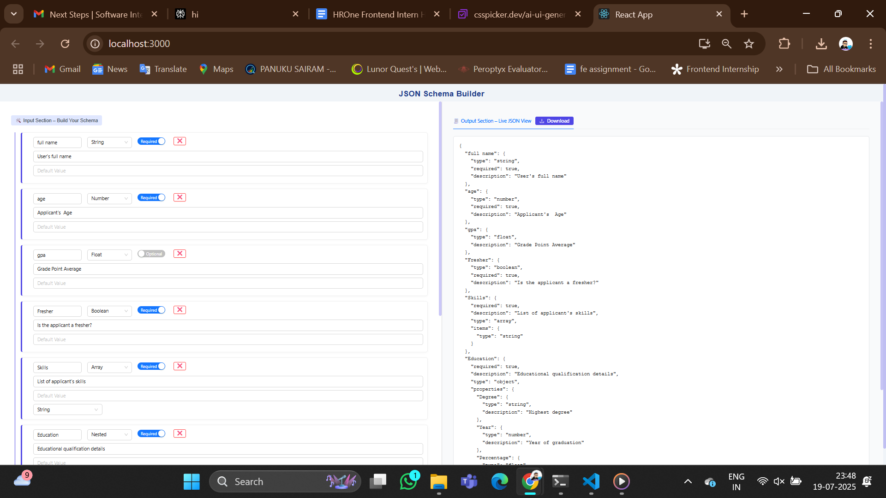

# 🧩 JSON Schema Builder

A modern and interactive web-based JSON schema builder that allows developers to visually create, preview, and export complex JSON schema structures with ease — including nested fields, arrays, enums, and more.

---

## 📷 Preview

> 🔁 Live editing on the left – real-time JSON output on the right!

 

---

## 🚀 Features

- 🔧 Drag-and-drop-like schema builder
- 📑 Supports types: `String`, `Number`, `Float`, `Boolean`, `Array`, `Nested`, `Enum`, `ObjectId`
- 🧠 Nested object and array support
- 📃 Live JSON preview
- ⬇️ One-click JSON download
- 🎨 Clean, responsive UI with Tailwind-inspired styling

---

## 🛠️ Technologies Used

- ⚛️ React
- 🧮 React Hook Form
- 📦 Ant Design (UI components)
- 💾 Blob + FileSaver for downloads
- 🧰 Custom SCSS / CSS modules

---

## 🔧 How to Run

1. Clone the repository
git clone https://github.com/your-username/json-schema-builder.git
cd json-schema-builder

 2. Install dependencies
npm install

 3. Start the development server
npm start

## 🏁 How to Use
```
🔠 Enter a field name (e.g. full name)

🧩 Choose a field type from the dropdown

🎯 Mark it as Required or Optional

📝 Optionally, add:

Description

Default value

Enum values (comma-separated)

➕ Add more fields using + Add Field

🧬 For nested objects, select Nested and define inner fields

📥 Click Download to export the schema
```
## 📚 Example Schema Output
```
{
  "full name": {
    "type": "string",
    "required": true,
    "description": "User's full name"
  },
  "age": {
    "type": "number",
    "required": true,
    "description": "Applicant's  Age"
  },
  "gpa": {
    "type": "float",
    "description": "Grade Point Average"
  },
  "Fresher": {
    "type": "boolean",
    "required": true,
    "description": "Is the applicant a fresher?"
  },
  "Skills": {
    "required": true,
    "description": "List of applicant's skills",
    "type": "array",
    "items": {
      "type": "string"
    }
  },
  "Education": {
    "required": true,
    "description": "Educational qualification details",
    "type": "object",
    "properties": {
      "Degree": {
        "type": "string",
        "description": "Highest degree"
      },
      "Year": {
        "type": "number",
        "description": "Year of graduation"
      },
      "Percentage": {
        "type": "float",
        "description": "Final Percentage"
      }
    }
  },
  "Job Location": {
    "description": "Preferred job location",
    "type": "string",
    "enum": [
      "Bangalore",
      "Hyderabad",
      "Pune",
      "Remote"
    ]
  }
}
```
## 📩 Feedback & Contribution
Have ideas to improve? Pull requests and suggestions are welcome! 😊

## 📄 License
MIT License © 2025 Panuku Sairam